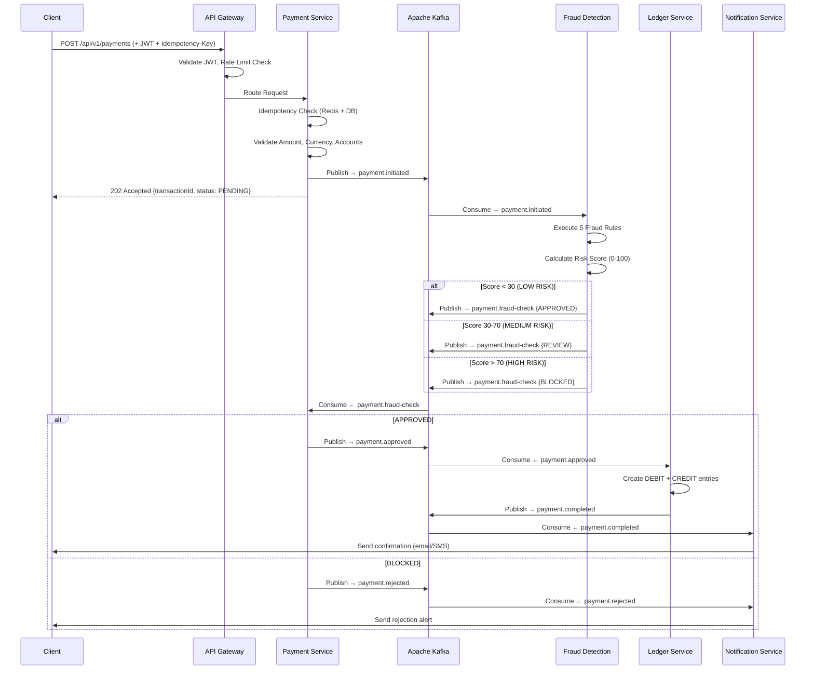

<div align="center">

[](https://manojbarkam17.github.io/payshield-platform/)  [](https://www.linkedin.com/in/manojbarkam17/)  [](https://github.com/ManojBarkam17)

# PayShield — Real-Time Payment Processing & Fraud Detection Platform

### Production-Grade Microservices | Event-Driven Architecture | Enterprise Fintech


A high-throughput, fault-tolerant payment processing platform that handles **real-time fraud detection**, **double-entry bookkeeping**, and **event-driven transaction orchestration** — built the way enterprise fintech systems actually work.

[Architecture](#architecture) · [Services](#microservices) · [Fraud Engine](#fraud-detection-engine) · [Run Locally](#getting-started) · [API Docs](#api-documentation)

</div>

---

## Why This Project Exists

Most "payment" projects on GitHub are CRUD apps with a Stripe checkout button. **PayShield is different.** It models how real payment platforms at companies like Mastercard, Stripe, and Square actually process transactions:

- Payments flow through an **event-driven pipeline** (not synchronous REST calls)
- Every transaction is **scored for fraud in real-time** before approval
- Money movement is tracked via a **double-entry ledger** (DEBIT + CREDIT for every transaction)
- The system handles **idempotency**, **rate limiting**, **circuit breakers**, and **distributed tracing** — the same patterns used in production fintech

---

## Architecture

```
┌─────────────────────────────────────────────────────────────────────────────┐
│                            CLIENT APPLICATIONS                              │
│                     (React Dashboard / Mobile / API)                        │
└──────────────────────────────┬──────────────────────────────────────────────┘
                               │
                               ▼
┌──────────────────────────────────────────────────────────────────────────────┐
│                         API GATEWAY (Port 8080)                              │
│              Spring Cloud Gateway | JWT Auth | Rate Limiting                 │
│                    Request Correlation | Circuit Breaker                     │
└───────┬──────────────┬──────────────┬──────────────┬────────────────────────┘
        │              │              │              │
        ▼              ▼              ▼              ▼
┌─────────────┐ ┌──────────┐ ┌────────────┐ ┌──────────────┐
│   Payment    │ │   User   │ │   Fraud    │ │   Ledger     │
│   Service    │ │  Service │ │ Detection  │ │   Service    │
│  (Port 8081) │ │ (8082)   │ │  (8083)    │ │  (8084)      │
│              │ │          │ │            │ │              │
│ Initiate     │ │ Register │ │ Rule Engine│ │ Double-Entry │
│ Validate     │ │ Auth     │ │ 5 Fraud    │ │ Bookkeeping  │
│ Idempotency  │ │ JWT      │ │ Rules      │ │ Account      │
│ Rate Limit   │ │ Profile  │ │ ML Scoring │ │ Balances     │
└──────┬───────┘ └──────────┘ └─────┬──────┘ └──────┬───────┘
       │                             │                │
       ▼                             ▼                ▼
┌──────────────────────────────────────────────────────────────────────────────┐
│                           APACHE KAFKA EVENT BUS                              │
│                                                                              │
│  Topics:  payment.initiated → payment.fraud-check → payment.approved         │
│           payment.rejected → payment.completed → ledger.entry                │
│           notification.send                                                  │
└──────────────────────────────────────────────────────────────────────────────┘
       │              │              │              │
       ▼              ▼              ▼              ▼
┌──────────────┐ ┌──────────┐ ┌────────────┐ ┌──────────────┐
│ PostgreSQL   │ │PostgreSQL│ │ PostgreSQL │ │ PostgreSQL   │
│ payment_db   │ │ user_db  │ │  fraud_db  │ │ ledger_db    │
└──────────────┘ └──────────┘ └────────────┘ └──────────────┘
                               ┌────────────┐
                               │   Redis     │
                               │ • Rate Limit│
                               │ • Velocity  │
                               │ • Caching   │
                               └────────────┘

┌──────────────────────────────────────────────────────────────────────────────┐
│                      NOTIFICATION SERVICE (Port 8085)                        │
│         Kafka Consumer | Email/SMS Templates | Event-Driven Alerts           │
└──────────────────────────────────────────────────────────────────────────────┘
```

### Event Flow — How a Payment Actually Processes



---

## Microservices

| Service | Port | Responsibility | Database | Key Patterns |
|---------|------|---------------|----------|--------------|
| **API Gateway** | 8080 | Routing, JWT auth, rate limiting, correlation IDs | — | Spring Cloud Gateway, Redis rate limiter |
| **Payment Service** | 8081 | Payment initiation, validation, lifecycle management | `payment_db` | Idempotency, Circuit Breaker, Saga |
| **User Service** | 8082 | User registration, authentication, JWT token management | `user_db` | BCrypt hashing, Refresh tokens |
| **Fraud Detection** | 8083 | Real-time fraud scoring, rule engine, case management | `fraud_db` | Strategy Pattern, Redis velocity |
| **Ledger Service** | 8084 | Double-entry bookkeeping, account balances, audit trail | `ledger_db` | DEBIT/CREDIT pairs, Optimistic locking |
| **Notification Service** | 8085 | Event-driven alerts, email/SMS templates | — | Kafka consumer, Template engine |

---

## Fraud Detection Engine

The fraud detection service uses a **Strategy Pattern** rule engine that scores every transaction in real-time. Each rule independently contributes a weighted score, and the aggregate determines the decision.

### Fraud Rules

| Rule | Trigger Condition | Risk Score | Real-World Rationale |
|------|------------------|------------|---------------------|
| **High Amount** | Transaction > $10,000 | +35 | Large transactions have higher fraud rates |
| **Velocity** | >5 transactions in 60 seconds | +30 | Rapid-fire transactions indicate card testing |
| **Time Pattern** | Transaction between 2–5 AM | +15 | Unusual hours correlate with unauthorized use |
| **New Account** | Account < 7 days old + amount > $1,000 | +25 | New accounts with large transactions are high-risk |
| **Geographic Anomaly** | Transaction from unusual location | +20 | Location changes indicate stolen credentials |

### Scoring & Decision Matrix

```
Score 0–29   → APPROVE  (auto-approve, low risk)
Score 30–70  → REVIEW   (flag for manual analyst review)
Score 71–100 → BLOCK    (auto-reject, high risk)
```

**Implementation:** Each rule implements a `FraudRule` interface (Strategy Pattern), making it trivial to add new rules without modifying existing code. The rule engine iterates through all active rules, collects scores, and publishes the decision to Kafka.

---

## Tech Stack

| Layer | Technology | Why This Choice |
|-------|-----------|----------------|
| **Language** | Java 17 | LTS, pattern matching, records, sealed classes |
| **Framework** | Spring Boot 3.2 | Industry standard for enterprise microservices |
| **API Gateway** | Spring Cloud Gateway | Reactive, non-blocking, native Spring integration |
| **Messaging** | Apache Kafka | Durable, ordered, replayable event streaming |
| **Primary DB** | PostgreSQL 15 | ACID compliance critical for financial data |
| **Cache/Rate Limit** | Redis 7 | Sub-ms latency for velocity checks and rate limiting |
| **Auth** | JWT (JJWT) | Stateless authentication across microservices |
| **Resilience** | Resilience4j | Circuit breaker, retry, bulkhead patterns |
| **Tracing** | Micrometer + Zipkin | Distributed tracing across service boundaries |
| **Containers** | Docker + Docker Compose | Consistent local dev, 14 containers orchestrated |
| **CI/CD** | GitHub Actions | Automated build, test, Docker push pipeline |
| **Cloud** | AWS (ECS, RDS, MSK, ElastiCache) | Production deployment target |

---

## Production-Grade Features

This isn't a tutorial project. These are the patterns that real fintech systems use:

**Idempotency** — Every payment request requires an `Idempotency-Key` header. Duplicate requests return the original response instead of creating duplicate transactions. Implemented via Redis (fast check) + DB unique constraint (guaranteed consistency).

**Rate Limiting** — Redis sliding window algorithm at the API Gateway. Default: 100 requests/minute per authenticated user. Prevents abuse and protects downstream services.

**Circuit Breaker** — Resilience4j circuit breakers on all inter-service calls. When a downstream service fails, the circuit opens and returns a fallback response instead of cascading failures across the system.

**Distributed Tracing** — Every request gets a correlation ID at the API Gateway that propagates through all Kafka events and service calls. Trace any transaction end-to-end via Zipkin.

**Double-Entry Bookkeeping** — The ledger service creates balanced DEBIT + CREDIT entries for every approved transaction. Account balances are derived from ledger entries, ensuring financial accuracy and auditability.

**Database-Per-Service** — Each microservice owns its database. No shared databases. Services communicate exclusively through Kafka events, ensuring loose coupling and independent deployability.

**Optimistic Locking** — `@Version` fields on critical entities prevent lost updates under concurrent access.

---

## Getting Started

### Prerequisites

- Java 17+
- Docker & Docker Compose
- Maven 3.8+

### Run the Entire Platform Locally

```bash
# Clone the repository
git clone https://github.com/ManojBarkam17/payshield-platform.git
cd payshield-platform

# Start all infrastructure (Kafka, PostgreSQL, Redis, Zipkin)
docker-compose up -d

# The init-db.sql runs automatically, creating:
#   → 5 databases (payment_db, user_db, fraud_db, ledger_db, notification_db)
#   → 10 tables with proper indexes
#   → Fraud rules seed data
#   → Test users and accounts

# Start each microservice (in separate terminals or use your IDE)
cd payment-service && mvn spring-boot:run
cd fraud-detection-service && mvn spring-boot:run
cd ledger-service && mvn spring-boot:run
cd notification-service && mvn spring-boot:run
cd api-gateway && mvn spring-boot:run
```

### Or Run Everything with Docker

```bash
docker-compose --profile all up -d
```

### Verify the Platform

```bash
# Health checks
curl http://localhost:8080/actuator/health   # API Gateway
curl http://localhost:8081/actuator/health   # Payment Service
curl http://localhost:8083/actuator/health   # Fraud Detection

# Zipkin UI (distributed tracing)
open http://localhost:9411

# Kafka UI (topic monitoring)
open http://localhost:9090

# pgAdmin (database management)
open http://localhost:5050
```

---

## API Documentation

### Create a Payment

```bash
curl -X POST http://localhost:8080/api/v1/payments \
  -H "Content-Type: application/json" \
  -H "Authorization: Bearer <jwt-token>" \
  -H "Idempotency-Key: unique-key-12345" \
  -d '{
    "sourceAccountId": "acc-001",
    "destinationAccountId": "acc-002",
    "amount": 250.00,
    "currency": "USD",
    "description": "Invoice payment #1042"
  }'
```

**Response (202 Accepted):**
```json
{
  "transactionId": "txn_8f14e45f-ceea-4e3d-bb72-9e8c6b1a3f7d",
  "status": "PENDING",
  "amount": 250.00,
  "currency": "USD",
  "createdAt": "2024-01-15T10:30:00Z"
}
```

### Key API Endpoints

| Method | Endpoint | Description |
|--------|----------|-------------|
| `POST` | `/api/v1/payments` | Initiate a new payment |
| `GET` | `/api/v1/payments/{id}` | Get payment status and details |
| `GET` | `/api/v1/payments/history` | Get payment history for user |
| `POST` | `/api/v1/users/register` | Register a new user |
| `POST` | `/api/v1/users/login` | Authenticate and get JWT |
| `GET` | `/api/v1/fraud/cases` | List fraud cases (analyst view) |
| `PUT` | `/api/v1/fraud/cases/{id}/review` | Submit analyst fraud review |
| `GET` | `/api/v1/ledger/accounts/{id}/balance` | Get account balance |
| `GET` | `/api/v1/ledger/accounts/{id}/entries` | Get ledger entries for account |

---

## Project Structure

```
payshield-platform/
├── api-gateway/                    # Spring Cloud Gateway
│   ├── src/main/java/.../
│   │   ├── config/                 # Route definitions, CORS
│   │   └── filter/                 # JWT auth, rate limit, logging filters
│   ├── Dockerfile
│   └── pom.xml
├── payment-service/                # Core payment processing
│   ├── src/main/java/.../
│   │   ├── controller/             # REST endpoints
│   │   ├── service/                # Business logic, idempotency
│   │   ├── model/                  # Transaction entity
│   │   ├── dto/                    # Request/Response DTOs
│   │   ├── repository/             # JPA repositories
│   │   ├── kafka/                  # Producers and consumers
│   │   ├── config/                 # Kafka, Redis, Security config
│   │   └── exception/              # Global exception handling
│   ├── Dockerfile
│   └── pom.xml
├── fraud-detection-service/        # Real-time fraud scoring
│   ├── src/main/java/.../
│   │   ├── engine/                 # Rule engine + Strategy pattern
│   │   ├── rules/                  # Individual fraud rules
│   │   ├── model/                  # FraudCase, FraudRule entities
│   │   ├── kafka/                  # Event consumers/producers
│   │   └── service/                # Scoring and decision logic
│   ├── Dockerfile
│   └── pom.xml
├── ledger-service/                 # Double-entry bookkeeping
│   ├── src/main/java/.../
│   │   ├── model/                  # LedgerEntry, Account entities
│   │   ├── kafka/                  # Payment event consumers
│   │   └── service/                # Bookkeeping logic
│   ├── Dockerfile
│   └── pom.xml
├── notification-service/           # Event-driven notifications
│   ├── src/main/java/.../
│   │   ├── kafka/                  # Multi-topic consumers
│   │   └── service/                # Template-based messaging
│   ├── Dockerfile
│   └── pom.xml
├── docker-compose.yml              # 14 containers orchestrated
├── init-db.sql                     # 5 databases, 10 tables, seed data
├── prometheus.yml                  # Metrics collection config
└── ARCHITECTURE.md                 # Deep-dive architecture document
```

---

## Architecture Decisions

| Decision | Choice | Rationale |
|----------|--------|-----------|
| Async over Sync | Kafka events between services | Payments require durability and ordering; sync REST creates tight coupling and cascading failures |
| Database per Service | Separate PostgreSQL databases | Enforces bounded contexts; services can be deployed, scaled, and migrated independently |
| Redis for Rate Limiting | Sliding window counter | Sub-millisecond checks at the gateway; doesn't add latency to the payment flow |
| Strategy Pattern for Fraud | Pluggable rule interface | New fraud rules can be added without modifying existing code; rules can be enabled/disabled via DB |
| Double-Entry Ledger | DEBIT + CREDIT pairs | Financial industry standard; ensures books always balance; provides complete audit trail |
| Idempotency Keys | Client-provided + server-enforced | Prevents duplicate charges from network retries — critical for payment systems |

---

## AWS Production Deployment

```
┌───────────────────────────────────────────────────────────┐
│                      AWS Cloud (us-east-1)                 │
│                                                            │
│  ┌──────────────┐                                         │
│  │     ALB      │  ← HTTPS termination                   │
│  └──────┬───────┘                                         │
│         │                                                  │
│  ┌──────▼───────┐                                         │
│  │  ECS Fargate │  ← API Gateway + 5 microservices        │
│  │  (6 tasks)   │     Auto-scaling on CPU/memory          │
│  └──────┬───────┘                                         │
│         │                                                  │
│  ┌──────▼───────┐  ┌──────────────┐  ┌────────────────┐  │
│  │  Amazon MSK  │  │  Amazon RDS  │  │  ElastiCache   │  │
│  │  (Kafka)     │  │ (PostgreSQL) │  │  (Redis)       │  │
│  │  3 brokers   │  │  Multi-AZ    │  │  Cluster mode  │  │
│  └──────────────┘  └──────────────┘  └────────────────┘  │
│                                                            │
│  ┌──────────────┐  ┌──────────────┐                       │
│  │  CloudWatch  │  │   X-Ray      │                       │
│  │  (Logs)      │  │  (Tracing)   │                       │
│  └──────────────┘  └──────────────┘                       │
└───────────────────────────────────────────────────────────┘
```

---

## Monitoring & Observability

| Tool | URL | Purpose |
|------|-----|---------|
| **Zipkin** | `http://localhost:9411` | Distributed tracing across all services |
| **Kafka UI** | `http://localhost:9090` | Topic monitoring, consumer lag, message inspection |
| **pgAdmin** | `http://localhost:5050` | Database management and query execution |
| **Spring Actuator** | `/actuator/health` on each service | Health checks, metrics, info endpoints |
| **MailHog** | `http://localhost:8025` | Email testing (catches all outbound emails) |

---

## Screenshots

> **Dashboard** — Real-time payment monitoring with transaction status, fraud scores, and throughput metrics

`[Screenshot placeholder — add after building React frontend]`

> **Fraud Detection** — Analyst view showing flagged transactions with risk scores and rule breakdown

`[Screenshot placeholder — add after building React frontend]`

---

## Contributing

Pull requests are welcome. For major changes, please open an issue first to discuss what you'd like to change.

1. Fork the repository
2. Create your feature branch (`git checkout -b feat/amazing-feature`)
3. Commit your changes (`git commit -m 'feat: add amazing feature'`)
4. Push to the branch (`git push origin feat/amazing-feature`)
5. Open a Pull Request

---

## License

This project is licensed under the MIT License — see the [LICENSE](LICENSE) file for details.

---

<div align="center">

**Built by [Manoj Barkam](https://github.com/ManojBarkam17)** — Java Full Stack Developer

*This is not a tutorial project. This is how real payment systems work.*

</div>
